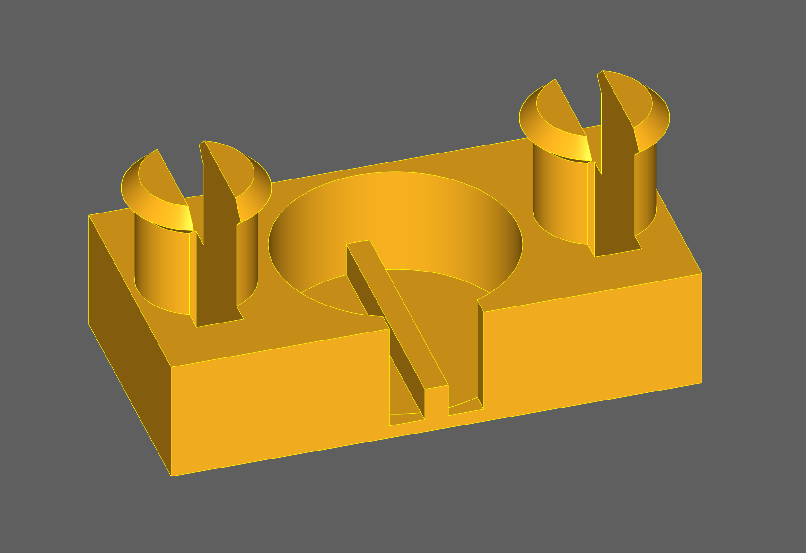

Motor clip for compass belt
===========================

This clip is designed to hold a 10 mm diameter vibration motor, and attach to a belt [like this](https://www2.hm.com/de_de/productpage.0907409001.html), in order to form a compass belt!

If you want to change the parameters, you can run the Python script with [CadQuery](https://cadquery.readthedocs.io).
